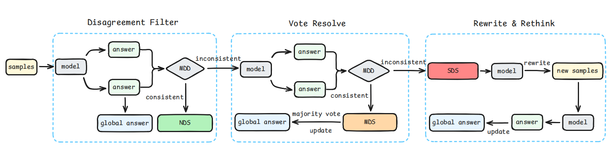
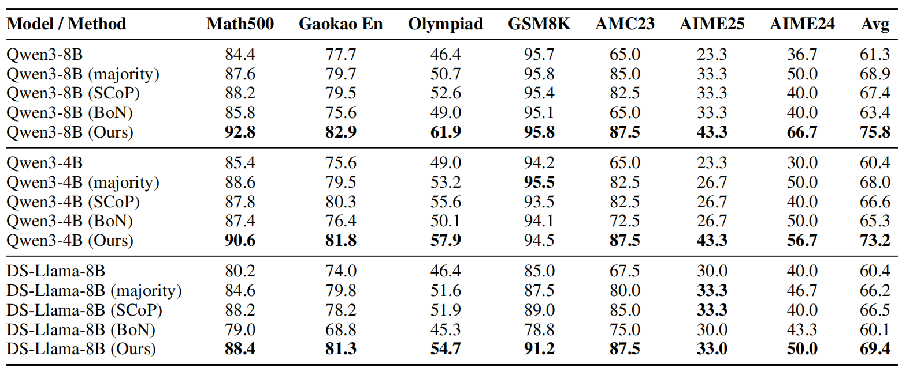
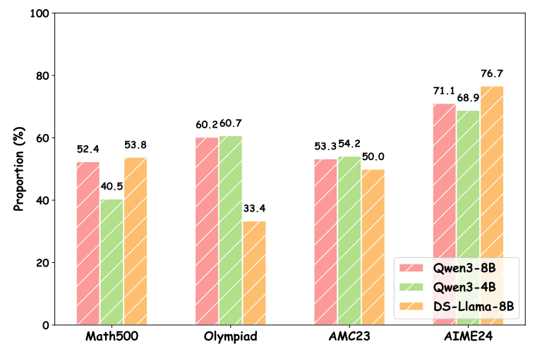
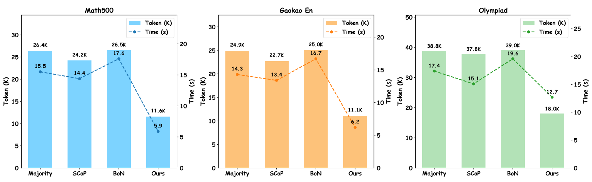

# Disagreement-Aware Repeated Sampling and Selective Rewriting for Complex Mathematical Reasoning

<div align="center">

</div>

> This figure illustrates the overall workflow of our method, where MDD, NDS, MDS, and SDS stand for Minimal Disagreement Detector, No Disagreement Samples, Minor Disagreement Samples, and Severe Disagreement Samples, respectively. The four model blocks in the figure all refer to the same model.

## Main Results
### Better Performance
<div align="center">

</div>

> We select three methods for comparison: majority voting (majority), Best of N with outcome reward model (BoN), and [SCoP](https://github.com/Yue-LLM-Pit/SCoP/).
> Our experimental settings use a temperature of 0.6, a top-p value of 0.95, and a top-k value of 20.

### Lower Cost
<div align="center">

</div>
<div align="center">

</div>


## Quick Start
### Installation
```bash
conda create -n DAR python==3.9
conda activate DAR
pip install -r requirements.txt
```

### Run
```bash
cd Qwen2.5-Math/evaluation/
bash sh/eval_by_our_method.sh
```

## Acknowledgement
We utilize [vLLM](https://github.com/vllm-project/vllm) for inference and develop evaluation scripts based on [Qwen2.5-Math](https://github.com/QwenLM/Qwen2.5-Math/tree/main/evaluation).
